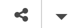

# Code Blocks Activity 1 | Surprised Emoji!

When you are finished with this activity, your Trinket should look like a minimal version of the surprised face emoji. Follow the steps below to get there, and feel free to skip a step and come back to it if you're stumped: 

1. [Sign into https://trinket.io/](https://trinket.io/) with your Allegheny Google account, and then open the starter blocks [here](https://trinket.io/glowscript-blocks/cbf2f8904f).
2. Make your own copy of the code blocks by hitting the **Remix** button on the upper right of the code editor. 
3. It looks like this emoji is missing an eye! But if you scroll down you'll see variables for both `left_eye` and `right_eye`? You can actually fix by changing the math operation on the `x` position for one of the eyes. Can you figure out how to do it? 
4. The emoji's face looks more like an alien! Can you change the **value** of one of the first two variables to make the skin more like a classic emoji?
5. Can you change another variable's **value** to make the color of the eyes and mouth look more like a classic emoji? 
6. Once you've made all these changes, one eye color is still out of place! Can you fix this by applying one of the first two varables to the rogue eye's color property? 
7. When you are done, save your work!
8. Turn in your work by clicking the Share button, then clicking Link and copying the link. Paste your link into the [Google Form]() and turn it in! 
